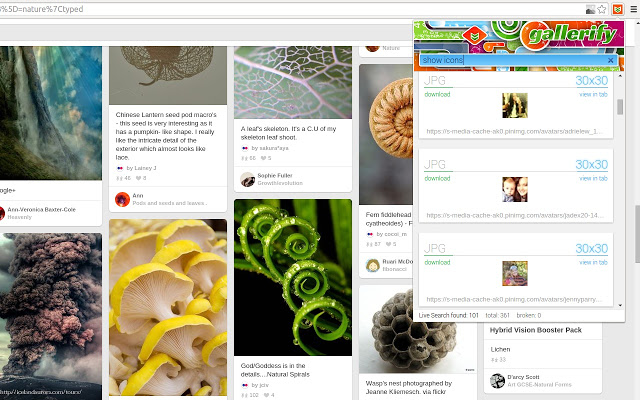

## Reverse engineering chrome extension: Gallerify

[Gallerify - Powerful Image Downloader](https://chrome.google.com/webstore/detail/gallerify-powerful-image/hlmlhalegjopepcnfbnphmpobjkjhdgk/related?hl=en)

This extension allows you to browse and download all the images displayed on any web page. Simply use the Gallerify button in the top right corner of your Chrome browser and a popup window will list them all.

1. It uses browser action's popup page to select and download the images.
2. It uses permissions "tabs" to inject scripts to pages, while using message passing to determine when to download the images.
